## House plants

<table>
  <tr>
    <th width="50%">Photo</th>
    <th>Info</th>
  </tr>
  <tr>
    <td valign="top">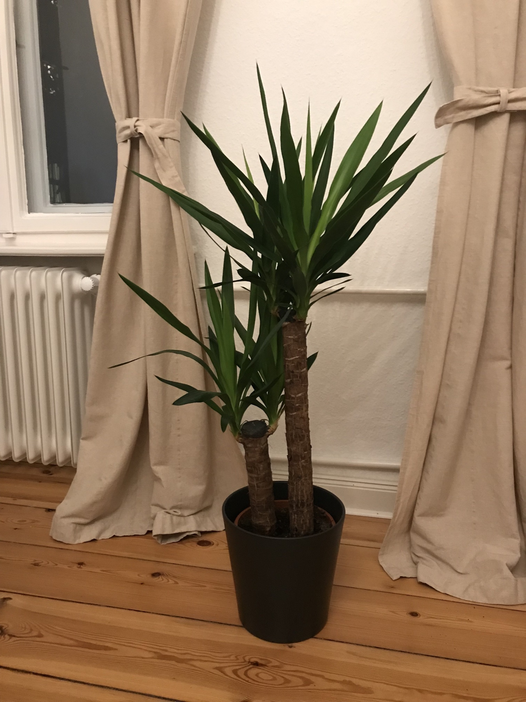</td>
    <td valign="top">
      <b>Yucca Elephantipes</b>
    </td>
  </tr>
  <tr>
    <td valign="top">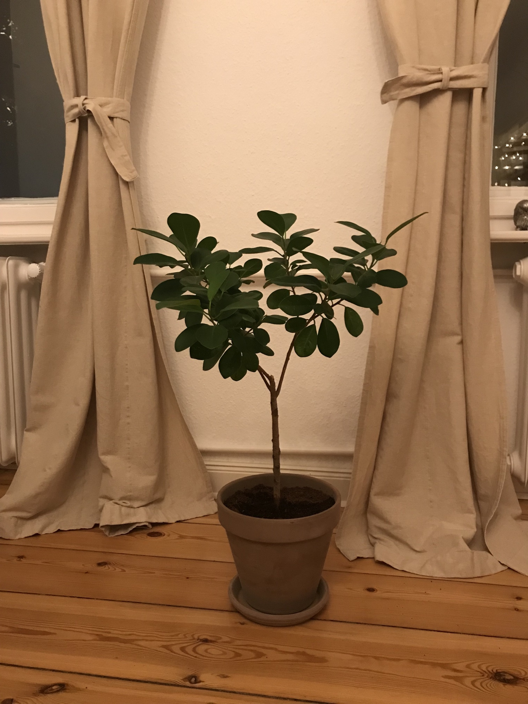</td>
    <td valign="top">
      <b>Ficus Microcarpa Moclame</b> 
      
       
      Min Temperature: 12°C
    </td>
  </tr>
  <tr>
    <td valign="top">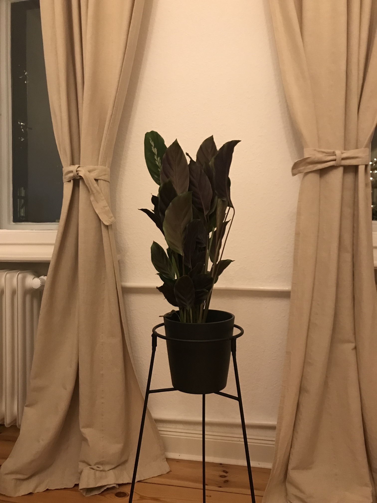</td>
    <td valign="top">
      <b>Calathea Hybriden</b>
    </td>
  </tr>
  <tr>
    <td valign="top">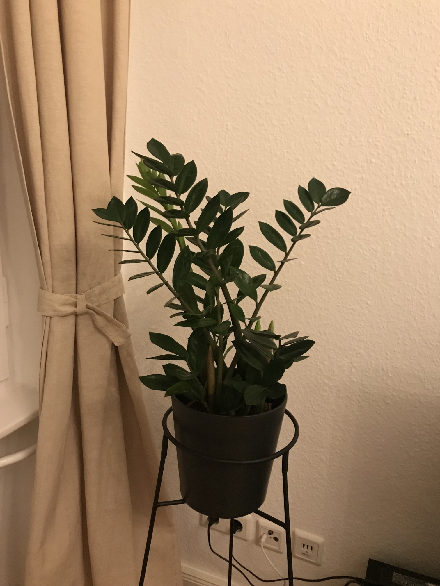</td>
    <td valign="top">
      <b>Zamioculcas Zamiifolia</b> 
      
       
      Min Temperature: 12°C
    </td>
  </tr>
  <tr>
    <td valign="top">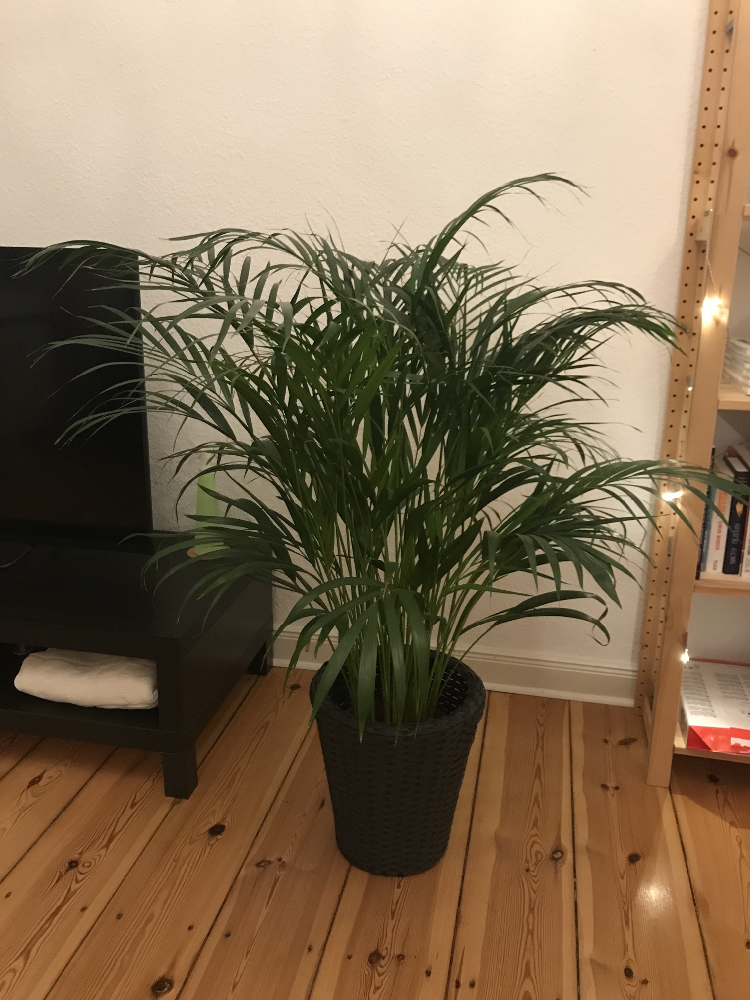</td>
    <td valign="top">
      <b>Chrysalidocarpus Lutescens</b> 
      
       
      Min Temperature: 15°C 
      RU Links: 
      - <a href="https://agronomu.com/bok/1413-bolezni-i-vrediteli-palm-sposoby-profilaktiki-i-borby.html#h-id-5">Болезни и вредители пальм: способы профилактики и борьбы</a> 
      - <a href="https://www.greeninfo.ru/indoor_plants/chrysalidocarpus.html/Forum/-/tID/7236">Белый налет на стебле хризалидокарпуса</a>
    </td>
  </tr>
  <tr>
    <td valign="top">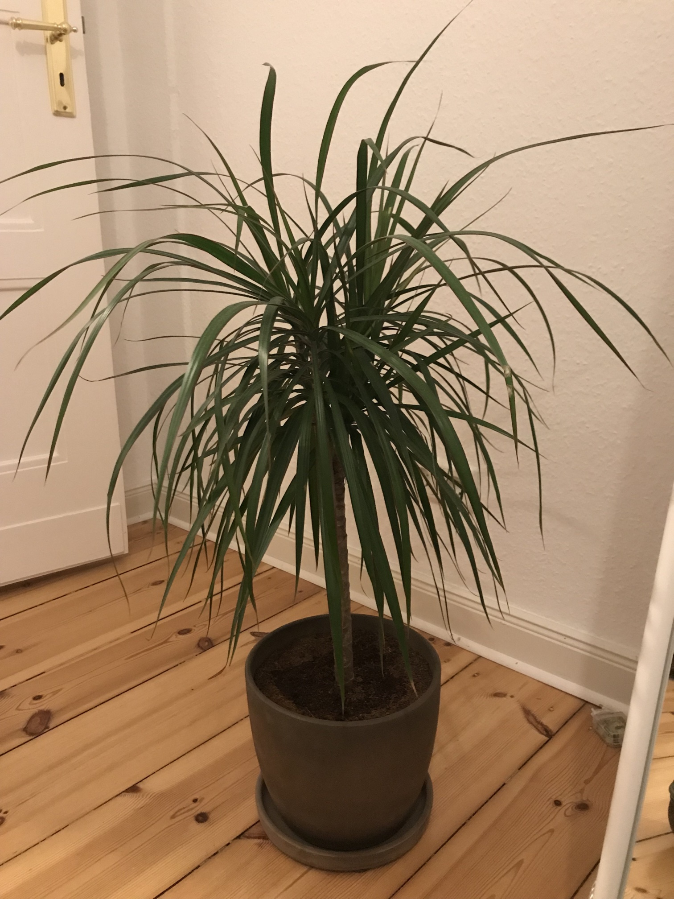</td>
    <td valign="top">
      <b>Dracaena Marginata</b> 
      
      
    </td>
  </tr>
  <tr>
    <td valign="top">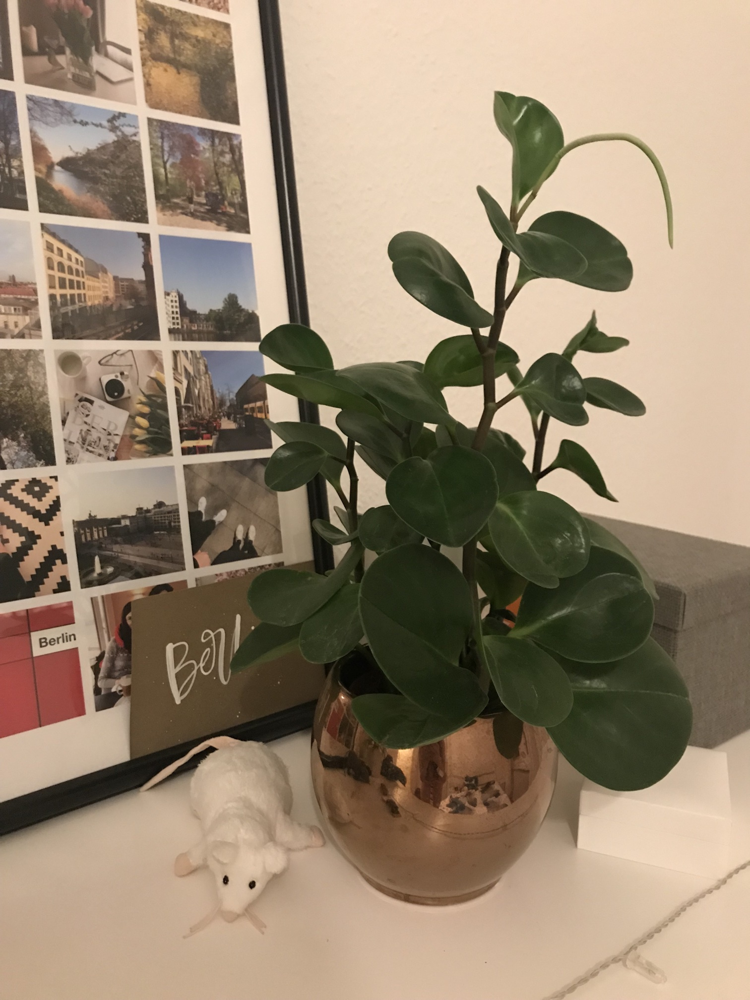</td>
    <td valign="top">
      <b>Peperomia Obtusifolia</b> 
      
      
       
      Temperature: 12°C - 25°C
    </td>
  </tr>
  <tr>
    <td valign="top">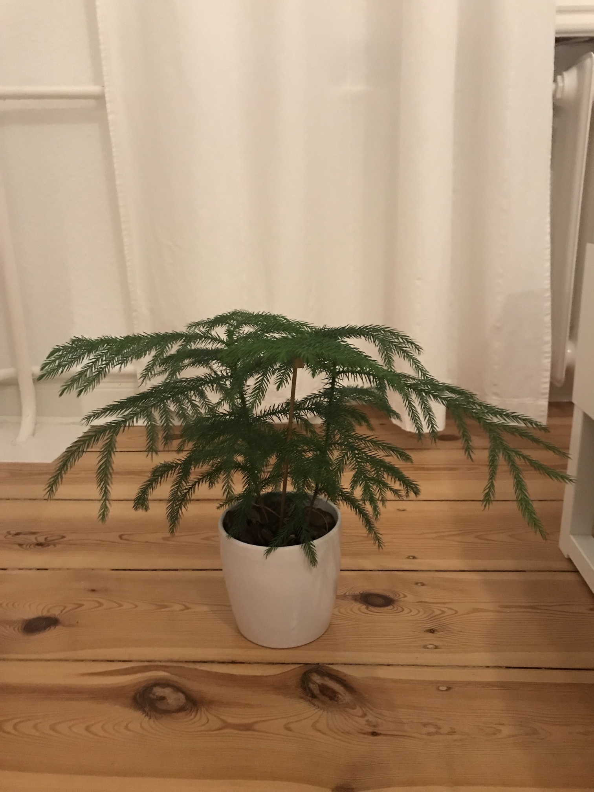</td>
    <td valign="top">
      <b>Araucaria Heterophylla*</b>
    </td>
  </tr>
  <tr>
    <td valign="top">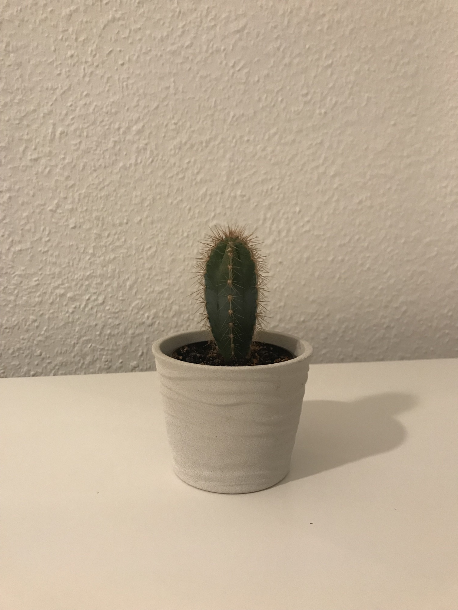</td>
    <td valign="top">
      <b>Cactus*</b>
    </td>
  </tr>
  <tr>
    <td valign="top">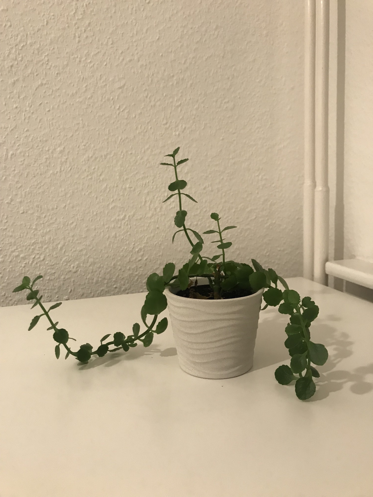</td>
    <td valign="top">
      <b>Violet*</b>
    </td>
  </tr>
  <tr>
    <td valign="top">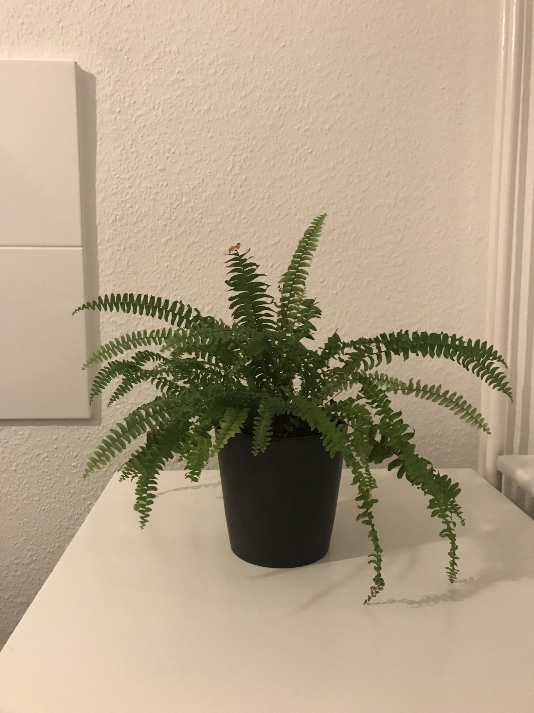</td>
    <td valign="top">
      <b>Nephrolepis Green Lady</b>
    </td>
  </tr>
  <tr>
    <td valign="top"></td>
    <td valign="top">
      <b>Monstera Deliciosa*</b> 
      
       
      Temperature: 20°C - 35°C
    </td>
  </tr>
  <tr>
    <td valign="top"></td>
    <td valign="top">
      <b>Epipremnum Aur Ampel</b> 
      
      
       
      Temperature: 18°C - 22°C
    </td>
  </tr>
</table>